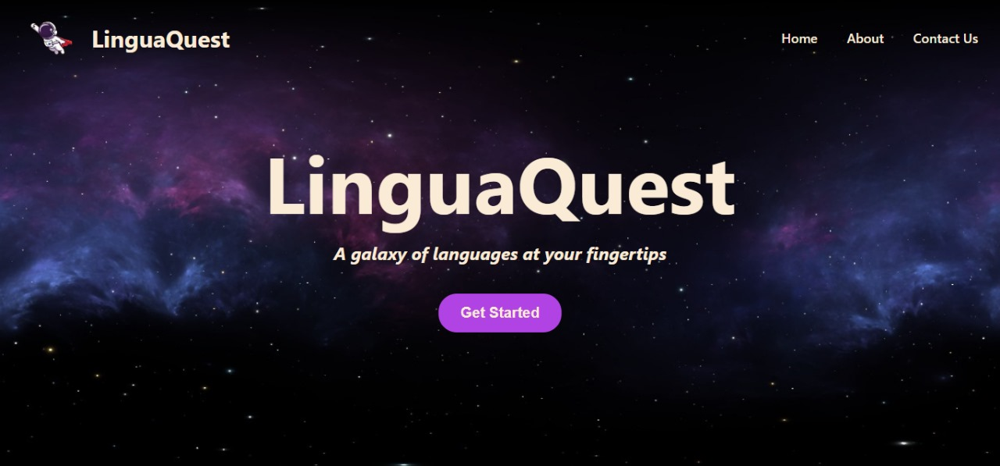
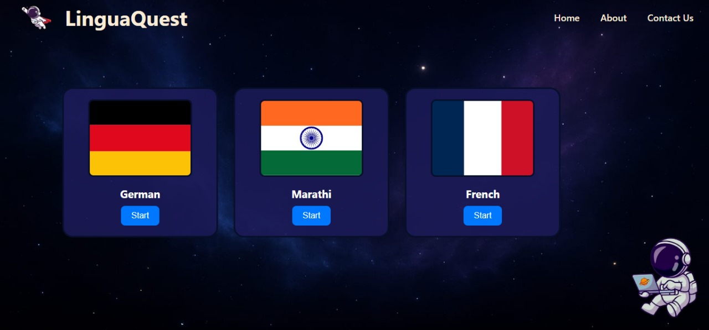
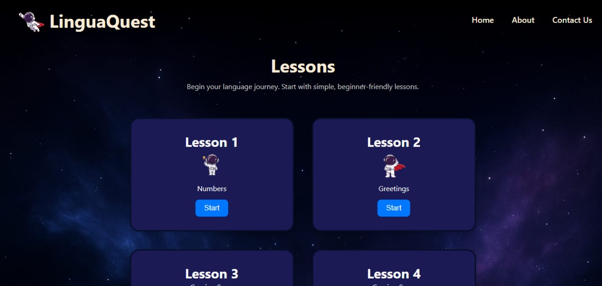
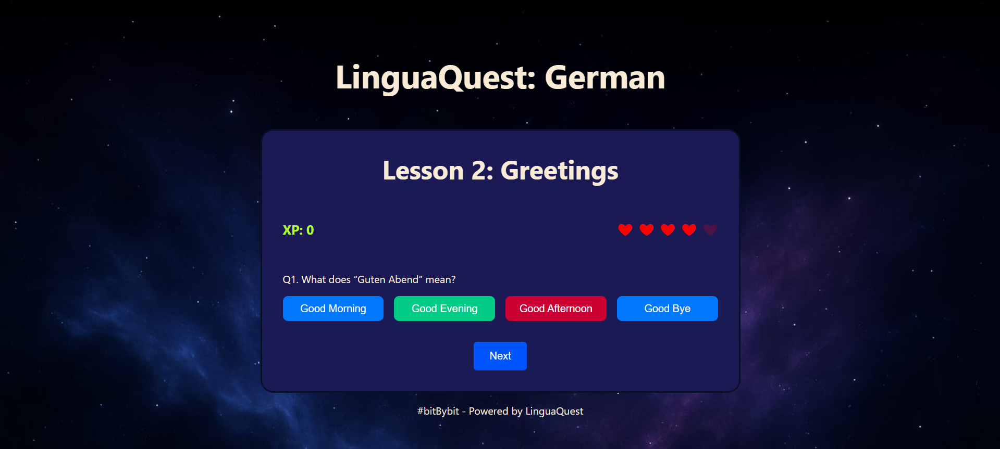
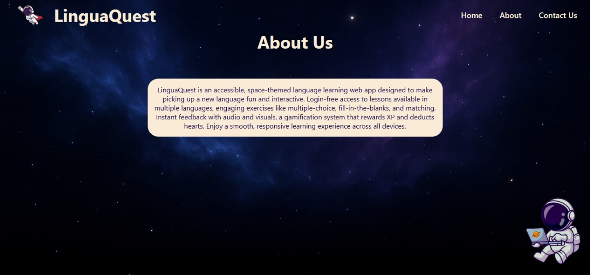
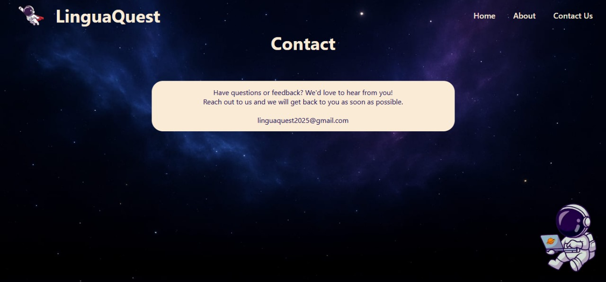

  #  LinguaQuest  
*A gamified language learning website with interactive lessons and instant feedback.*

## 📚 Table of Contents
- About
- Features
- Demo
- Tech Stack
- Media Credits
- Team

## 📖 About  
LinguaQuest is an accessible, engaging, and gamified website designed to help users learn new languages through interactive lessons and audio-visual feedback. Built with frontend web technologies, it supports various question types like fill-in-the-blank, MCQs, drag-and-drop, and audio-based interactions.

## 🚀 Features
- 👤 User-friendly interface with a beautiful theme  
- 🎮 Gamified lessons with XP and heart system  
- 🧩 Interactive exercises (FIB, MCQ, drag-and-drop, audio)  
- 🔠 Case-insensitive answer matching (e.g., `drei` and `Drei` are both accepted)  
- 🔊 Audio-based listening practice  
- 📱 Responsive layout (desktop, tablet, mobile)  
- 📝 Score tracking  

## 📽️ Demo  

### Screenshots  

  
  
  
  
  

## 🧰 Tech Stack
- HTML  
- CSS  
- JavaScript  
- GitHub  

## 🖼️ Media Credits

- Background images: AI generated  
- Astronaut illustrations: [Shutterstock - Astronaut Cute Vectors](https://www.shutterstock.com/search/astronaut-cute-vector?dd_referrer=https%3A%2F%2Fwww.google.com%2F)  
- Audio clips: [Voicemaker](https://voicemaker.in/)  
- Fonts:
  -  from [Google Fonts](https://fonts.google.com/) – Licensed under [SIL Open Font License](https://scripts.sil.org/OFL)

## 👥 Team

- **Saniya Bagwan**  
- **Manasvi Gore**  
- **Sanchita Patil**  
- **Shravani Sawant**

